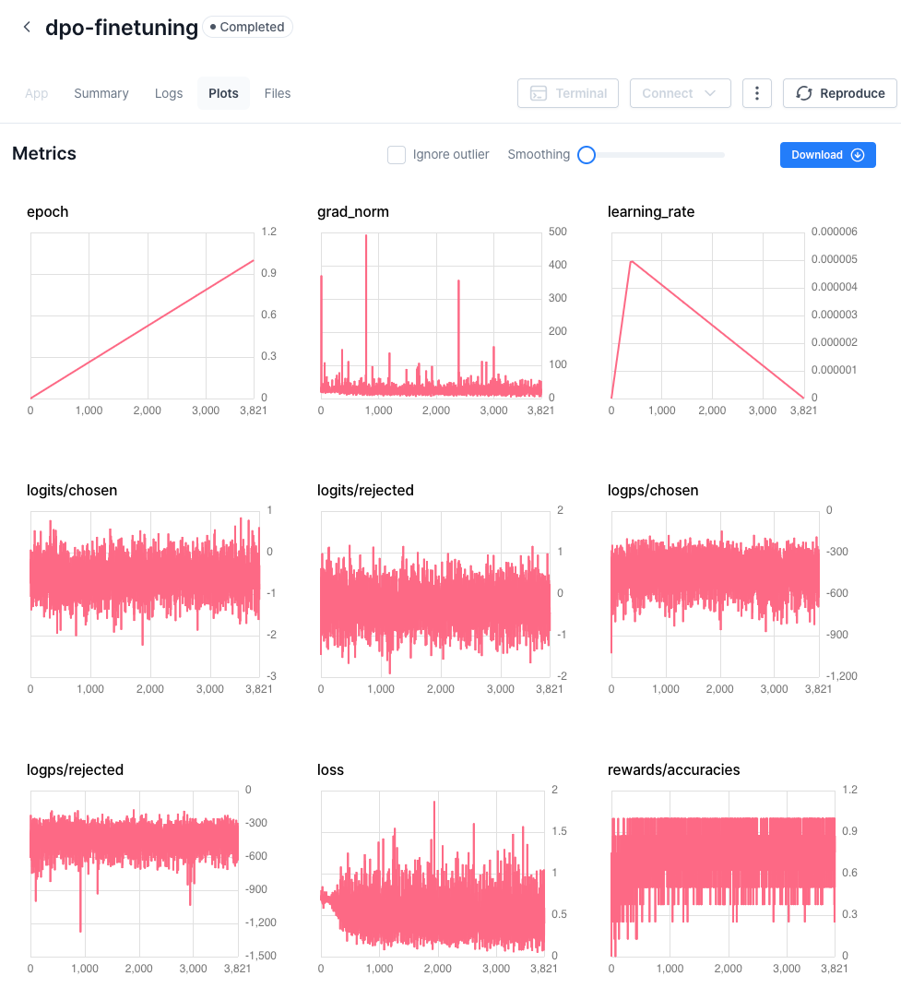
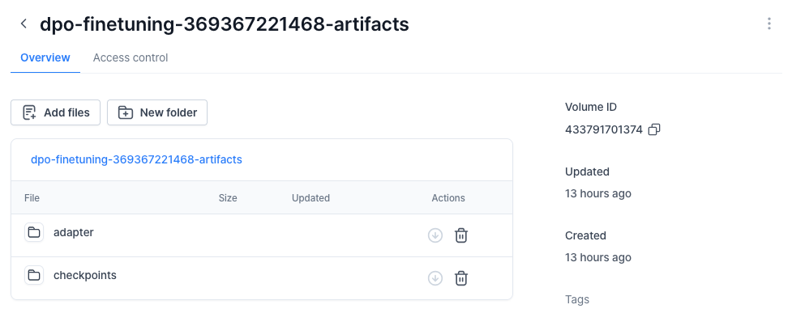

# Direct Preference Optimization (DPO) Fine-Tuning Example

This repository provides a clean and minimal example of **Direct Preference Optimization (DPO) fine-tuning** for Large Language Models using the HuggingFace🤗 ecosystem.

DPO fine-tuning allows you to fine-tune models based on prompts and pairs of responses. This approach enables the model to learn from more subjective human preferences, optimizing for outputs that are more likely to be favored. 

It is designed for practitioners who want to quickly prototype, benchmark, and extend DPO fine-tuning pipelines with modern Transformer models.

## How to Run it Locally

1. Clone the repository:

   ```bash
   git clone https://github.com/vessl-ai/vessl-training-recipes.git
   cd vessl-training-recipes/DPO
   ```

1. Install the required dependencies:

   ```bash
   pip install trl unsloth
   ```

1. Run the fine-tuning job:

   ```bash
   python train.py --base-model-name $MODEL_NAME --dataset $DATASET_NAME
   ```

   Replace `$MODEL_NAME` and `$DATASET_NAME` with the model you want to fine-tune and the dataset, respectively.

## Running on VESSL

VESSL is a platform for running and managing AI applications. It allows you to run your fine-tuning job on the cloud with a single command, and provides a web interface for managing your metrics.

To run the fine-tuning job on VESSL, follow these steps:

1. (Optional) Create a new project on VESSL.

1. Use the provided YAML file ([`run.yaml`](./run.yaml)) to configure the fine-tuning job, including resources, image, import statements, run commands, and environment variables.

1. Run the job on VESSL using the configured YAML file:

    ```bash
    vessl run create -f run.yaml
    ```

You can check the metrics and output files (checkpoints and the fine-tuned adapter) at the Run info page.



